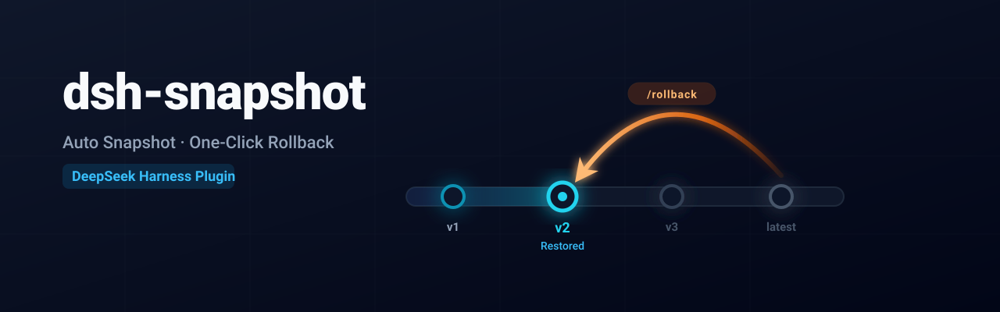
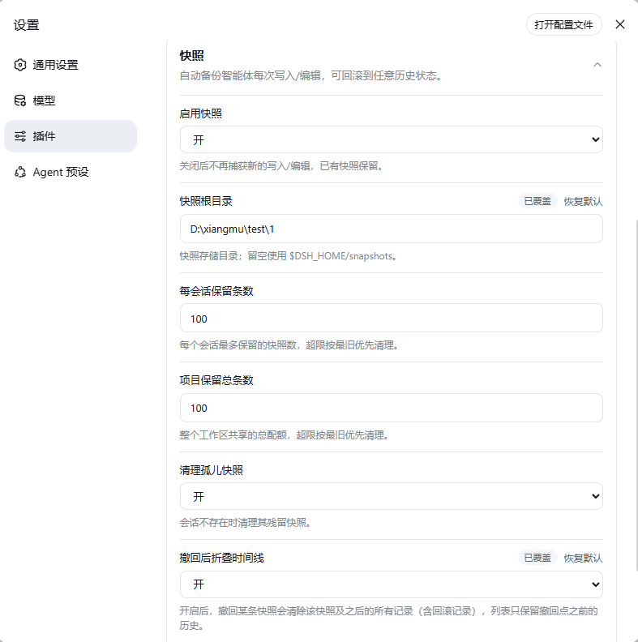

<p align="center"> 
   
</p>

<p align="center"> 
  <a href="README.md">简体中文</a> | <strong>English</strong> 
</p> 
 
<p align="center"> 
  <a href="https://www.npmjs.com/package/dsh-snapshot"></a> 
  <a href="LICENSE"></a> 
   
</p>

A DeepSeek Harness (DSH) Web plugin for **automatic snapshots and one-click rollback** — before every `write`/`edit` it saves the target file contents, and before a shell deletion (`Remove-Item`, `rm`) it saves the doomed file's contents, so `/rollback` restores any earlier snapshot (modeled after Trae's checkpoint capability). It also ships a sidebar "snapshot timeline" panel and a settings card.

## Features

Before every `write`/`edit` the target file contents are snapshotted, and a shell deletion (`Remove-Item`, `rm`) first snapshots the doomed file's contents; records append to the session's `snapshots.jsonl`. All snapshots triggered by the same user message are folded into one group: **the timeline shows one row per message, and rolling back a row restores every change that message produced**.

### UI

- **Snapshot timeline**: the sidebar's bottom "Snapshots" button opens a panel listing the current session's history. One row is one message — all write/edit/delete mutations it triggered are folded together, showing the message preview and a per-kind summary such as `Create ×2 · Modify ×1` (only kinds that occurred; **counts are per file**, repeated writes to the same file count once), plus the file path when the message touched a single file (rollback records read "Rollback to snapshot #N"). Click a row to roll back the whole message's changes (the current state is recorded first, so you can roll back again); rolling back a message folds away everything after it by default (`collapseOnRollback`). Hovering a row lists every file it touches with its Create/Modify/Delete kind, and hovering the time shows the full timestamp. The panel footer has a "Check for updates" entry on the bottom left and the plugin version on the bottom right. The header "Clear" button asks for confirmation before deleting all snapshots.


- **Settings card**: the plugin config page shows a snapshot card with two-state switches for booleans and number fields that fall back to the plugin default when blank or restored; edits apply immediately.

### Commands

- `/rollback list` lists the snapshot history (one line per message)
- `/rollback <seq> --yes` restores all the changes of one message (the current state is recorded first, so you can roll back again)
- `/rollback --call <callId> --yes` rolls back a single snapshot by tool call
- `/rollback clear --yes` clears all snapshots of this session

## Install

Install the plugin into a **profile** (`dsh web` uses the `web` profile) with the `dsh plugin` command; it writes the dependency and the bundle list for you, no manual editing:

```sh
dsh plugin --profile web add dsh-snapshot
```

Prerequisites:

- A working `dsh` CLI on the machine. If it is not installed, run the same commands with `npx @deepseek-ai/dsh` in place of `dsh`:

```sh
npx @deepseek-ai/dsh plugin --profile web add dsh-snapshot  # install the plugin into the web profile
npx @deepseek-ai/dsh web                                    # start dsh web
```

- A global `pnpm` on the machine (`dsh plugin` invokes pnpm to install dependencies inside the profile directory); if it is missing, run `npm install -g pnpm` first.

Then restart `dsh web`. `dsh plugin` adds `dsh-snapshot` to the profile's `dependencies` and `dsh.profile.bundles` (the bundle list is the enablement entry point), and the plugin's `cordis.patch.yml` injects the `snapshot` entry into the profile config tree.

For local development, build the source directory and point the profile at it with a `link:` dependency instead of the registry version (see "Development").

## Upgrade

`dsh plugin add` does not bump an existing dependency, so upgrade by pinning the new version inside the profile directory:

```sh
cd ~/.dsh/profiles/web
pnpm add dsh-snapshot@<new-version>
```

Then fully stop and restart `dsh web`, and hard-refresh the browser with `Ctrl+Shift+R` (client-side copy such as the "Undo" button label lives in the browser bundle and keeps showing the old text until the cache is cleared).

## Usage

See [Commands](#commands) and [UI](#ui) above.

## Configuration (all optional; works with zero config)

| key | default | description |
|---|---|---|
| `enabled` | `true` | Master switch; when off, new writes/edits/deletes are no longer captured, existing snapshots are kept (rollback still works) |
| `storeDir` | `$DSH_HOME/snapshots` | Snapshot root directory, one subdirectory per session |
| `maxRetain` | `100` | Max snapshots kept per session; `0` means unlimited |
| `maxProjectRetain` | `100` | Project-wide cap: all sessions sharing a workspace (session cwd) share this quota; on overflow the oldest by capture time is pruned; `0` means unlimited |
| `pruneOrphans` | `true` | Orphan pruning: when the workspace directory of a session no longer exists, all its snapshots are deleted (unrollbackable, space only); `false` keeps them |
| `collapseOnRollback` | `true` | Collapse the timeline on rollback: restoring a message also removes that message and everything after it (rollback records included); the list keeps only the history before the rollback point. `false` keeps the superseded snapshots and the rollback record |

Configuration can be done in either of two ways; the keys match the table above.

### Method 1: the settings page (form)

The client settings page shows the snapshot card under "Plugin Configuration"; the form edits every key in the table above. Saving writes through the host settings service into the `snapshot:` section of `~/.dsh/settings.yaml`.



Whether the card is editable depends on the host's namespace allow-list (`WEB_SETTINGS_NAMESPACES` of `dsh-host-apiproxy`): when it contains `snapshot` the card renders an editable form, otherwise it only shows a note (form unavailable). Note that the allow-list is a **constant baked into the host source, not a runtime setting** — the npm release currently does not include `snapshot`, so the form cannot be edited under an npm host (it shows "form unavailable"); a local harness master source build already includes the namespace and edits directly. To get the form under the npm host, wait for a newer host release.

### Method 2: edit the config file

Skip the settings page and edit a config file directly; either location works:

- The `snapshot:` section of `~/.dsh/settings.yaml` (the same location the settings page writes to):

```yaml
snapshot:
  storeDir: D:\xiangmu\test\1
  collapseOnRollback: true
```

- The profile's `cordis.yml` (the `web` profile maps to `~/.dsh/profiles/web/cordis.yml`):

```yaml
plugins:
  snapshot:
    storeDir: D:\xiangmu\test\1
```

Restart `dsh web` after editing for the change to take effect.

## Development

```sh
pnpm install && pnpm typecheck && pnpm build
```

`pnpm build` runs `tsc` (server half, file-by-file emit) followed by `tsdown` (browser half bundled into a single `lib/client.js`, loaded by the loader module table).

- The build is fully self-contained: every `@deepseek-ai/*` SDK package (including `react`) is declared in devDependencies and resolved from the npm registry; the tsconfig does not reference any harness source checkout.
- Runtime dependencies: `@deepseek-ai/schemastery`, `@deepseek-ai/dsh-settings` (with `@deepseek-ai/cordis`) are declared as peers and provided by the harness host; the other `@deepseek-ai/*` imports are all `import type` and erased at compile time. The client bundle only externals `react`, `@deepseek-ai/dsh-client-runtime/client` (snapshot storage engine) and `@deepseek-ai/dsh-client-ui-primitives` (icon components, both provided at runtime by the loader module table); everything else is inlined.
