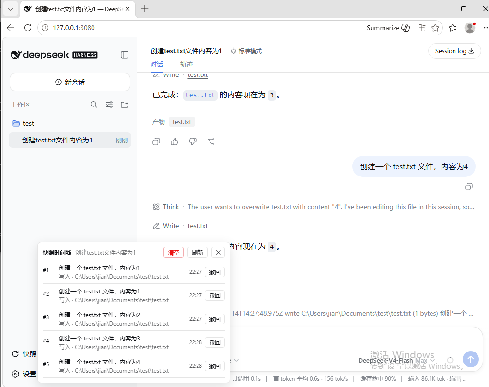
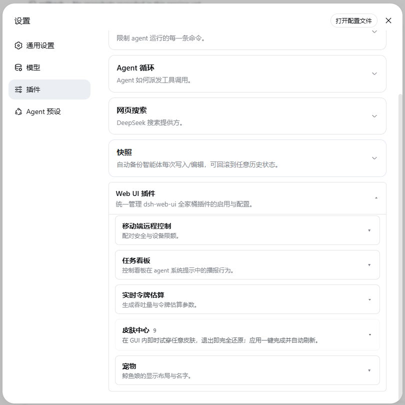

# dsh-snapshot

> English: [README.en.md](README.en.md)

**自动快照、一键回滚**的 DeepSeek Harness 插件——agent 每次 `write`/`edit` 前自动保存目标文件内容,`/rollback` 命令可恢复到任意历史快照(参考 Trae 的 Checkpoint 能力)。附带侧边栏"快照时间线"面板与设置页配置卡片。

## 功能

每次 `write`/`edit` 前自动快照目标文件内容,追加进该会话的 `snapshots.jsonl`,并记录触发快照的用户消息开头作为标注。

### 界面操作

- **快照时间线**:侧边栏底部「快照」按钮点击打开面板,列出当前会话全部快照,每条显示触发快照的用户消息预览(回滚记录显示"回滚至快照 #N")、工具与文件路径;点击某条即回滚到该状态(回滚前自动记录当前状态,可再回滚);头部「清空」按钮二次确认后删除全部快照。



- **配置卡片**:设置页「插件配置」中的 snapshot 卡片,布尔字段为二态开关、数字字段留空或「恢复默认」回退默认值,改动即时生效。

### 命令操作

- `/rollback list` 列出快照
- `/rollback <seq> --yes` 恢复到指定快照(恢复前先记录当前状态,可再回滚)
- `/rollback --call <callId> --yes` 按工具调用回滚
- `/rollback clear --yes` 清空该会话全部快照

## 安装

插件通过 `dsh plugin` 命令安装进 **profile**(`dsh web` 对应 `web` profile),自动写入依赖与 bundle 列表,无需手动编辑:

```sh
dsh plugin --profile web add dsh-snapshot
```

前提:

- 机器上有全局 `dsh` CLI。未安装时直接用 `npx @deepseek-ai/dsh` 代替 `dsh` 执行同一命令:

```sh
npx @deepseek-ai/dsh plugin --profile web add dsh-snapshot  # 安装插件到 web profile
npx @deepseek-ai/dsh web                                    # 启动 dsh web
```

- 机器上有全局 `pnpm`(`dsh plugin` 内部会在 profile 目录调用 pnpm 安装依赖),缺失时先执行 `npm install -g pnpm`。

装完重启 `dsh web` 即可。`dsh plugin` 会把 `dsh-snapshot` 写入 profile 的 `dependencies` 与 `dsh.profile.bundles`(bundle 列表即插件启用入口),插件的 `cordis.patch.yml` 负责把 `snapshot` 条目注入 profile 配置树。

本地开发时构建源码目录,并在 profile 里用 `link:` 指向它代替 registry 版本,见下文「开发」。

## 更新

`dsh plugin add` 对已存在的依赖不会自动升级,升级需在 profile 目录显式指定新版本:

```sh
cd ~/.dsh/profiles/web
pnpm add dsh-snapshot@<新版本号>
```

然后完全退出 `dsh web` 再重启,并在浏览器 `Ctrl+Shift+R` 硬刷新(「撤回」按钮等客户端文案在浏览器 bundle 里,不清缓存会继续显示旧文案)。

## 用法

```sh
/rollback list          # 列出本会话的全部快照
/rollback <seq> --yes   # 把文件恢复到某条快照(恢复前会先记录当前状态,可再回滚)
/rollback clear --yes   # 清空本会话全部快照
```

## 配置(均可选,零配置可用)

| key | 默认 | 说明 |
|---|---|---|
| `enabled` | `true` | 总开关,关闭后不再捕获新的写入/编辑,已有快照保留(回滚仍可用) |
| `storeDir` | `$DSH_HOME/snapshots` | 快照存储根目录,每会话一个子目录 |
| `maxRetain` | `100` | 每会话最大保留条数,`0` 为不限 |
| `maxProjectRetain` | `100` | 项目级总量控制:同一工作区(会话 cwd)所有会话共享该配额,超限按捕获时间最旧优先清理,`0` 为不限 |
| `pruneOrphans` | `true` | 孤儿清理:某会话所属工作区目录已不存在时,自动删除该会话全部快照(不可回滚,仅占空间),`false` 为保留 |
| `collapseOnRollback` | `true` | 撤回后折叠时间线:撤回某条快照会同时清除该快照及之后的所有记录(含回滚记录),列表只保留撤回点之前的历史;`false` 则保留后续快照与回滚记录 |

配置可通过以下两种方式之一进行,键名与上表一致。

### 方法一:设置页(配置表单)

dsh 客户端设置页的「插件配置」会显示 snapshot 卡片,在表单内可直接修改上表各项。保存后经宿主 settings 服务写入 `~/.dsh/settings.yaml` 的 `snapshot:` 段。



卡片是否可编辑取决于宿主的命名空间白名单(`dsh-host-apiproxy` 的 `WEB_SETTINGS_NAMESPACES`):白名单包含 `snapshot` 时显示可编辑表单,否则只显示说明文字(表单不可用)。注意该白名单是**宿主源码内的常量,不是运行时配置**——npm 发布版目前未包含 `snapshot`,因此在 npm 版宿主下无法通过设置页修改(显示"表单不可用");本地 harness master 源码构建已包含该命名空间,可直接编辑。npm 版用户要启用表单需等新版宿主发布。

### 方法二:改配置文件

不经过设置页,直接编辑配置文件,两种位置任选其一:

- `~/.dsh/settings.yaml` 的 `snapshot:` 段(与设置页写入同一位置):

```yaml
snapshot:
  storeDir: D:\xiangmu\test\1
  collapseOnRollback: true
```

- profile 的 `cordis.yml`(如 `web` profile 对应 `~/.dsh/profiles/web/cordis.yml`):

```yaml
plugins:
  snapshot:
    storeDir: D:\xiangmu\test\1
```

改完重启 `dsh web` 生效。

## 开发

```sh
pnpm install && pnpm typecheck && pnpm build
```

`pnpm build` 依次运行 `tsc`(服务端逐文件编译)与 `tsdown`(浏览器端打成单个 `lib/client.js`,由 loader 模块表加载)。

- 类型与构建完全自包含:所有 `@deepseek-ai/*` SDK 包(含 `react`)在 devDependencies 中显式声明并解析自 npm registry,tsconfig 不引用任何 harness 源码 checkout。
- 运行时依赖:`@deepseek-ai/schemastery`、`@deepseek-ai/dsh-settings`(与 `@deepseek-ai/cordis`)以 peer 形式声明,由 harness 宿主提供;其余 `@deepseek-ai/*` 均为 `import type`,编译后擦除。client bundle 仅 external `react`、`@deepseek-ai/dsh-client-runtime/client`(快照存储引擎)与 `@deepseek-ai/dsh-client-ui-primitives`(图标组件,运行时均由 loader 模块表提供),其余全部内联。
