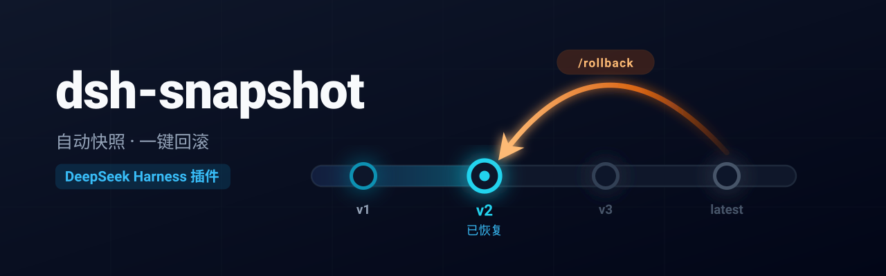

<div align="center">
  
</div>

<p align="center"> 
  <strong>简体中文</strong> | <a href="README.en.md">English</a> 
</p> 
 
<p align="center"> 
  <a href="https://www.npmjs.com/package/dsh-snapshot"></a> 
  <a href="LICENSE"></a> 
   
</p>

**自动快照、一键回滚**的 DeepSeek Harness（DSH）Web 插件。

> Agent 每次 `write`/`edit` 前自动保存目标文件内容，经 shell 执行删除（如 `Remove-Item`、`rm`）时也先保存被删文件内容，支持 `/rollback` 命令恢复到任意历史快照（类似 Trae 的 Checkpoint 能力）。
> 附带侧边栏 **“快照时间线”** 面板与 **设置页配置卡片**。

---

## 功能

每次 `write`/`edit` 前自动快照目标文件内容；agent 经 shell 执行删除（如 `Remove-Item`、`rm`）时，先快照被删文件的内容再放行。所有快照追加进该会话的 `snapshots.jsonl`。同一用户消息引发的所有快照自动归为一组：**时间线以「对话」为单位显示一行，撤回一行即整体还原该对话产生的全部修改**。

### 界面操作

- **快照时间线**
  侧边栏底部「快照」按钮点击打开面板，列出当前会话的快照历史。
  - **一行 = 一次对话**：同一条用户消息引发的多次写入/编辑/删除合并为一行，显示该消息的预览与「创建/修改/删除」统计（如 `创建 ×2 · 修改 ×1`，只列出出现的类型；**按文件数统计**，同一文件多次写入只计一次）；仅改动一个文件时附上文件路径。
  - 点击某行即**整体撤回该对话产生的全部修改**（撤回前自动记录当前状态，支持再次撤回）。
  - 撤回某一对话后，其后的历史默认一并折叠（由 `collapseOnRollback` 控制）。
  - 头部「清空」按钮可二次确认后删除全部快照。

<div align="center">
  
</div>

- **配置卡片**
  设置页「插件配置」中的 snapshot 卡片。布尔字段为二态开关，数字字段留空或点击「恢复默认」即可回退，**改动即时生效**。

### 命令操作

```sh
/rollback list                     # 列出快照历史（每次对话一行）
/rollback <seq> --yes              # 整体撤回指定对话产生的全部修改（撤回前先记录当前状态，可再撤回）
/rollback --call <callId> --yes    # 按工具调用撤回单个快照
/rollback clear --yes              # 清空该会话全部快照
```

## 安装

插件通过 `dsh plugin` 命令安装进 **profile**（`dsh web` 对应 `web` profile），自动写入依赖与 bundle 列表，无需手动编辑：

```sh
dsh plugin --profile web add dsh-snapshot
```

<details>
<summary><strong>💡 没有全局 dsh 命令怎么办？</strong></summary>

未安装全局 CLI 时，可直接使用 `npx` 执行：

```sh
npx @deepseek-ai/dsh plugin --profile web add dsh-snapshot  # 安装插件到 web profile
npx @deepseek-ai/dsh web                                    # 启动 dsh web
```

*注意：`dsh plugin` 内部会调用 `pnpm` 安装依赖，请确保机器已安装 `pnpm`。*
</details>

装完重启 `dsh web` 即可。
> `dsh plugin` 会自动把 `dsh-snapshot` 写入 profile 的 `dependencies` 与 `dsh.profile.bundles`，并通过 `cordis.patch.yml` 将 `snapshot` 注入配置树。

## 更新

`dsh plugin add` 对已存在的依赖不会自动升级，升级需在 profile 目录显式指定新版本：

```sh
cd ~/.dsh/profiles/web
pnpm add dsh-snapshot@<新版本号>
```

> **⚠️ 注意**：更新后需完全退出 `dsh web` 再重启，并在浏览器 `Ctrl+Shift+R` 硬刷新（清除浏览器 bundle 缓存，否则旧文案不会更新）。

## 用法

见上方 [命令操作](#命令操作) 与 [界面操作](#界面操作)。

## 配置（均可选，零配置可用）

| 配置项 | 默认值 | 说明 |
|---|---|---|
| `enabled` | `true` | **总开关**，关闭后不再捕获新的写入/编辑/删除，已有快照保留（回滚仍可用） |
| `storeDir` | `$DSH_HOME/snapshots` | 快照存储根目录，每会话一个子目录 |
| `maxRetain` | `100` | 每会话最大保留条数，`0` 为不限 |
| `maxProjectRetain` | `100` | **项目级总量控制**：同一工作区（会话 cwd）所有会话共享该配额，超限按捕获时间最旧优先清理，`0` 为不限 |
| `pruneOrphans` | `true` | **孤儿清理**：某会话所属工作区目录已不存在时，自动删除该会话全部快照（不可回滚，仅占空间），`false` 为保留 |
| `collapseOnRollback` | `true` | **撤回后折叠时间线**：撤回某次对话会同时清除该对话及之后的所有记录（含回滚记录），列表只保留撤回点之前的历史；`false` 则保留后续快照与回滚记录 |

配置可通过以下两种方式之一进行。

### 方法一：设置页（配置表单）

dsh 客户端设置页的「插件配置」会显示 snapshot 卡片，在表单内可直接修改上表各项。保存后经宿主 settings 服务写入 `~/.dsh/settings.yaml` 的 `snapshot:` 段。

<div align="center">
  
</div>

> **ℹ️ 表单不可用？**
> 卡片是否可编辑取决于宿主的命名空间白名单（`dsh-host-apiproxy` 的 `WEB_SETTINGS_NAMESPACES`）。
> 目前 npm 发布版宿主暂未包含 `snapshot` 白名单，因此会显示“表单不可用”；本地 harness master 源码构建已包含该命名空间，可直接编辑。npm 版用户需等待新版宿主发布，期间请使用方法二。

### 方法二：修改配置文件

不经过设置页，直接编辑配置文件，以下两种位置任选其一：

**位置 1：** `~/.dsh/settings.yaml` 的 `snapshot:` 段（与设置页写入同一位置）
```yaml
snapshot:
  storeDir: D:\xiangmu\test\1
  collapseOnRollback: true
```

**位置 2：** profile 的 `cordis.yml`（如 `web` profile 对应 `~/.dsh/profiles/web/cordis.yml`）
```yaml
plugins:
  snapshot:
    storeDir: D:\xiangmu\test\1
```

*改完重启 `dsh web` 生效。*

## 开发

```sh
pnpm install && pnpm typecheck && pnpm build
```

`pnpm build` 会依次运行 `tsc`（服务端逐文件编译）与 `tsdown`（浏览器端打成单个 `lib/client.js`，由 loader 模块表加载）。

- **类型与构建完全自包含**：所有 `@deepseek-ai/*` SDK 包（含 `react`）在 `devDependencies` 中显式声明并解析自 npm registry，`tsconfig` 不引用任何 harness 源码 checkout。
- **运行时依赖**：`@deepseek-ai/schemastery`、`@deepseek-ai/dsh-settings`（与 `@deepseek-ai/cordis`）以 peer 形式声明，由 harness 宿主提供；其余 `@deepseek-ai/*` 均为 `import type`，编译后擦除。client bundle 仅 external `react`、`@deepseek-ai/dsh-client-runtime/client`（快照存储引擎）与 `@deepseek-ai/dsh-client-ui-primitives`（图标组件，运行时均由 loader 模块表提供），其余全部内联。
